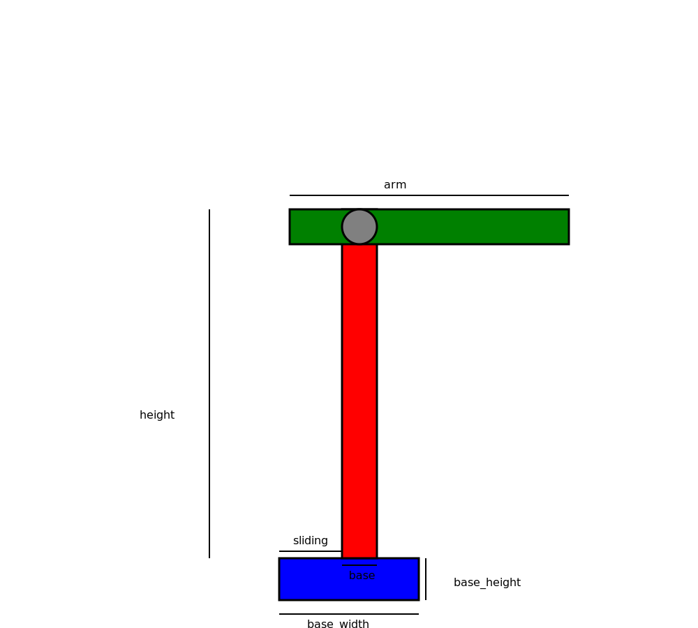

# FIRST HOMEWORK

## PRIMA PARTE

Nella prima parte è stato creato una semplice oggetto meccanico. L'ogetto  che si è scelto di rappresentare è stato quello di una gru.

Esempio device

### PARAMETRI

* _base-width_ : largezza della base di appoggio della gru;
* _base-height_ : altezza della base di appoggio della gru;
* _base_ : largezza della base della gru;
* _height_ : altezza della gru;
* _arm_ : lunghezza del braccio della gru;
* _angle_ : angolo del braccio dellla gru.

### VINCOLI
* Le lunghezze devono essere tutte positive;
* L'angolo deve essere compreso tra -90 e 90 gradi;
* L'altezza della base non deve supreare la sua lunghezza;
* la base della gru non deve superare la largezza della base di appoggio;
* L'altezza dellla gru deve essere maggiore della largezza dela base di appoggio;
* La gru può muoversi lungo la base di appoggio ma non può uscire da quessta;
* L'altezza della gru deve esssere maggiore della base;
* L'altezza della gru deve essere maggiore della lunghezza del braccio;
* Sono inoltre presenti vincoli che impediscono di uscire dallo spazio del disegno.

## SECONDA PARTE

Nella seconda parte si è integrato il meccanismo gu con un altro "device". Il device che ho scelto come suuporto è il carrello-gru di [Elia Bontempelli]().

Esempio machine

Il meccanismo è formato da coopie di gru e carrelli.È possibile fissare un numero di n istanze che verranno ripetute: la nuova coopia gru-carrello verra posto sulla piattaforma di quella precedente e sarà scalata di una certa grandezza.

### PARAMETRO

Il meccanismo presenta un solo parametro dato dalla posizione che si vuole dare sulla piattaforma allla coppia succesiva.

### VINCOLI
* La rotazione del braccio della gru deve essere 0;
* L'angolo del braccio del carrello deve essere compreso tra -80 e 0;
* La piattaforma non deve toccare la gru;
* Il carrello può muoversi lungo il braccio della gru ma non può uscire da questo;
* Limiti legati alla necessità di rimanere nel disegno.

## NOTE UTILI
* I test del secondo device sono stati tolti dal  file CMakeLists poichè alcune alcune limitazioni sono state commentate per ottenere la machine e quindi se si vuole testare vanno commentati o tolti i relativi test. Prima di utilizzare il device si è opportunamente controllato che i test passassero.
*  Grandezze indicative per ottenere i device sono:
CRANE:
  _base-width_: 200
  _base-height_: 60
  _base_: 50
  _height_:500
  _arm_ :400
  _angle_: 45 (mettere 0 se poi si vuole costruire una machine)
CARELLO-GRU:
 _length-shaft_:300
 _width-towtruck_:100
 _width_platform_: 200
 _rotation_: tra -80 e 0
 _sliding_: 50
 
 

  
  

 
 
